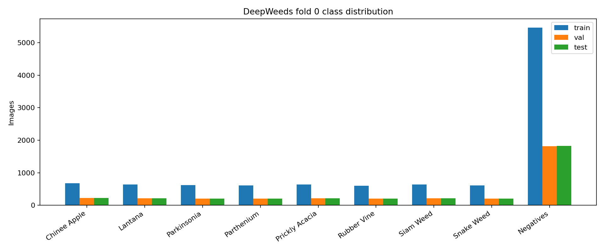
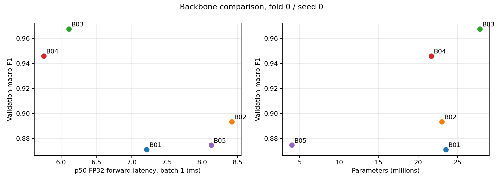
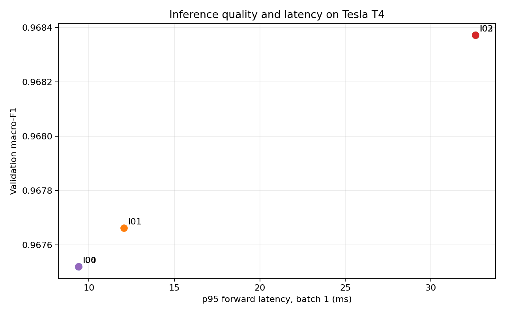
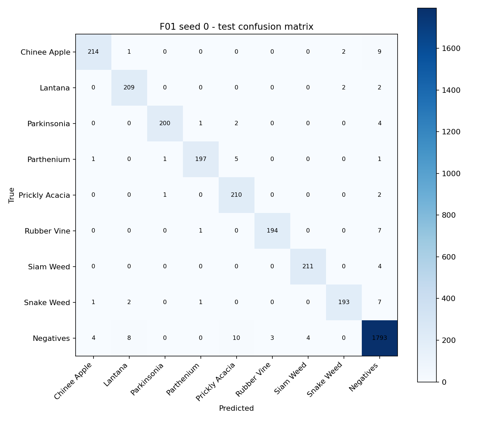
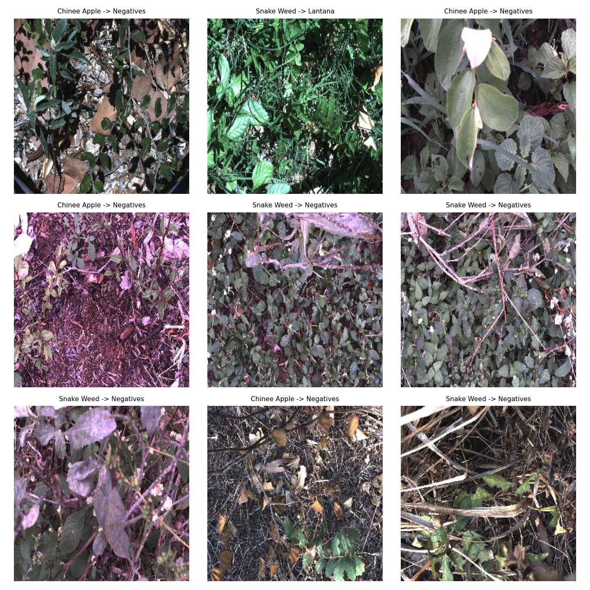

# DeepWeeds: backbone, công thức huấn luyện và suy luận

**Sinh viên:** 2026A02939, Trần Cao Quốc Định

**Notebook:** https://www.kaggle.com/code/anhtrangram/10-39
**Bài toán:** phân loại ảnh DeepWeeds thành 8 loài cỏ dại và lớp Negative.

## Tóm tắt

Tôi so sánh 5 backbone, 3 trục công thức huấn luyện qua 7 ablation và 5 chế độ suy luận trên fold 0. Cấu hình chốt bằng validation là ConvNeXt Tiny (`B03`, trọng số `timm/convnext_tiny.in12k_ft_in1k`) với 5-crop gộp xác suất (`I02`). Trên 3 seed, toàn bộ 3.507 ảnh test, cấu hình cuối `F01` đạt **top-1 0,9742 ± 0,0021**, **macro-F1 0,9673 ± 0,0030**; mốc ResNet50 1-view `T00` đạt tương ứng 0,8968 ± 0,0045 và 0,8657 ± 0,0075. Chênh lệch macro-F1 là +0,1017. Trong các ablation một seed, không công thức nào vượt `B03`; đóng băng backbone gây giảm lớn nhất. TTA 5-crop chỉ tăng +0,00085 macro-F1 validation so với 1-view, đổi lại độ trễ forward p95 tăng từ 9,38 lên 32,62 ms trên Tesla T4.

## Dữ liệu và thiết lập

DeepWeeds có 17.509 ảnh RGB 256×256, 9 lớp. Tôi dùng nguyên fold 0 của tác giả: **10.501 train / 3.501 validation / 3.507 test**. Ba giao theo `Filename` đều rỗng, hợp ba tập có 17.509 ảnh, và các file đều tồn tại. Lớp Negative có 9.106 ảnh (52,0%); trong tập train là 5.463/10.501. Phân bố và 3 ảnh mẫu mỗi lớp nằm trong `eda/`. Độ lệch này khiến accuracy không đủ phản ánh lỗi ở các loài hiếm; **macro-F1 9 lớp** là chỉ số chọn checkpoint và cấu hình.

Train dùng `RandomResizedCrop(224)` và lật ngang; validation/test dùng resize rồi center-crop 224, chuẩn hóa ImageNet. Công thức nền: trọng số pretrained, thay head 9 lớp, fine-tune toàn bộ, AdamW với LR backbone `1e-4`, LR head `1e-3`, weight decay `0,05` (norm/bias không decay), warmup 1 epoch rồi cosine, cross-entropy, AMP, batch 16, 12 epoch. Chọn epoch có macro-F1 validation cao nhất; hòa thì lấy epoch sớm hơn. Các kết quả sàng lọc dùng seed 0, chung kết dùng seed 0/1/2. Cấu hình, phiên bản thư viện và log theo epoch nằm trong `logs/`; mọi số trong bảng được tính lại từ `predictions/` bằng `eval.py`.

## So sánh backbone

Các backbone chạy trên cùng fold, seed và công thức nền; tag pretrained được ghi trong sheet `Backbones`.

| Mã | Backbone | Macro-F1 val | Top-1 val | Params (M) | GMAC | p50 batch-1 (ms) |
|---|---|---:|---:|---:|---:|---:|
| B01 | ResNet50 | 0,8712 | 0,9032 | 23,53 | 4,13 | 7,21 |
| B02 | ResNeXt50-32x4d | 0,8935 | 0,9180 | 23,00 | 4,29 | 8,42 |
| B03 | ConvNeXt Tiny | **0,9675** | **0,9746** | 27,83 | 4,45 | 6,11 |
| B04 | ViT Small | 0,9458 | 0,9597 | 21,67 | 4,24 | 5,76 |
| B05 | EfficientNet-B0 | 0,8747 | 0,9032 | 4,02 | 0,38 | 8,13 |

`B03` được chọn cho ablation vì có macro-F1 validation cao nhất, dù có nhiều tham số hơn. GMAC thấp không bảo đảm latency thấp: EfficientNet-B0 chỉ 0,38 GMAC nhưng p50 8,13 ms trên T4, chậm hơn `B03` trong phép đo forward này. Đây là kết quả một seed; thứ hạng kiến trúc còn bị ảnh hưởng bởi **tag trọng số pretrained khác nhau** (ConvNeXt/ViT được fine-tune từ tập tiền huấn luyện lớn hơn), nên không thể quy toàn bộ chênh lệch cho kiến trúc.

Các đường cong trong `curves/` cho thấy ResNet50 tăng macro-F1 val từ 0,4466 lên 0,8712, còn ConvNeXt Tiny từ 0,7987 lên 0,9675. Ở ConvNeXt, train loss giảm gần 0 nhưng val loss vẫn khoảng 0,125, cho thấy khoảng cách train/val và nhu cầu theo dõi quá khớp. Epoch cuối không luôn tốt nhất: B01, B02, B03 và B05 đều lấy checkpoint epoch 11 thay vì epoch 12.

## Ablation công thức huấn luyện

Mỗi thí nghiệm giữ `B03` làm nền và đổi một yếu tố, cùng seed 0, 12 epoch, batch 16. Trục khởi tạo dùng `finetune` so với `frozen`; trục augmentation dùng `basic`, `color`, `RandAugment`; trục loss dùng CE, label smoothing, focal và CE trọng số lớp. `T07` ghép `color` và focal, là hai biến thể có điểm cao nhất *trong từng trục*, nhằm kiểm tra tương tác.

| Mã | Thay đổi | Macro-F1 val | Δ so với B03 |
|---|---|---:|---:|
| B03 | Nền: fine-tune, basic, CE | **0,9675** | 0 |
| T01 | Đóng băng backbone | 0,8657 | -0,1018 |
| T02 | Color jitter | 0,9633 | -0,0042 |
| T03 | RandAugment | 0,9617 | -0,0059 |
| T04 | Label smoothing 0,1 | 0,9614 | -0,0061 |
| T05 | Focal γ=2 | 0,9645 | -0,0030 |
| T06 | CE trọng số lớp từ train | 0,9611 | -0,0064 |
| T07 | Color jitter + focal | 0,9550 | -0,0125 |

Đóng băng backbone giảm rõ rệt, cho thấy cần thích nghi đặc trưng với ảnh đồng ruộng. Các chênh lệch nhỏ 0,003–0,006 của augmentation/loss chỉ đo trên một seed, **chưa chứng minh được** kỹ thuật đó gây hại ổn định. `T07` thấp hơn cả T02 lẫn T05, nên hiệu ứng không cộng dồn trong lần chạy này. ECE validation của label smoothing là 0,0786, cao hơn CE nền 0,0165; điểm này cần kiểm tra thêm trên seed khác. Focal `γ=0` đã được unit test đối chiếu với CE, và class weight chỉ dùng số lượng train.

## Suy luận và độ trễ

Trên checkpoint `B03` seed 0, tôi so sánh 4 phương pháp ngoài mốc 1-view. Nhiệt độ `T=1,7457` được khớp trên validation; không khớp trên test. Độ trễ đo forward trên Tesla T4, FP32, batch 1, 224×224, 10 warmup và 50 lượt có đồng bộ GPU. **Tiền xử lý ảnh, đọc file và truyền dữ liệu CPU→GPU không nằm trong số đo**; p95 5-crop là 5 lượt forward đo liên tiếp và có thể thấp hơn độ trễ end-to-end.

| Phương pháp | K | Macro-F1 val | ECE val | p50/p95/p99 (ms) |
|---|---:|---:|---:|---:|
| I00 1-view | 1 | 0,96752 | 0,01646 | 5,99 / 9,38 / 9,49 |
| I01 lật ngang | 2 | 0,96766 | 0,01436 | 11,44 / 12,04 / 13,20 |
| I02 5-crop, gộp xác suất | 5 | **0,96837** | 0,01284 | 31,37 / 32,62 / 34,64 |
| I03 5-crop, gộp logit | 5 | **0,96837** | 0,01361 | 31,37 / 32,62 / 34,64 |
| I04 temperature scaling | 1 | 0,96752 | **0,00753** | 5,99 / 9,38 / 9,49 |

`I02` được chốt vì đồng hạng macro-F1 cao nhất và ECE thấp hơn `I03`. So với 1-view, mức tăng chỉ **0,00085** trên một seed, nhỏ hơn std macro-F1 test cuối (0,0030); vì vậy không thể nói 5-crop chắc chắn tốt hơn 1-view. Temperature scaling cải thiện ECE validation nhưng không đổi argmax; nó không nằm trong cấu hình test `F01`. Nếu tối ưu thời gian thực, tôi ưu tiên ConvNeXt Tiny 1-view; nếu ưu tiên điểm dự đoán và chấp nhận ~5 lần forward, dùng 5-crop đã chốt. Cả hai phép đo forward p95 đều dưới 100 ms trên T4, nhưng độ trễ hệ thống thực tế cần đo riêng trên phần cứng robot.

## Chung kết trên test

Sau khi chốt cấu hình bằng validation, tôi train lại `F01` và mốc `T00` với seed 0, 1, 2; mỗi model lấy checkpoint theo macro-F1 val. Mỗi file test chứa **đủ 3.507 ảnh**. `eval.py score` đã kiểm tra xác suất, nhãn, thứ tự lớp và đối chiếu CSV gốc. Số sau là trung bình ± std mẫu (`ddof=1`) qua ba seed:

| Cấu hình | Macro-F1 val | Macro-F1 test | Top-1 test | ECE test |
|---|---:|---:|---:|---:|
| F01: ConvNeXt Tiny + 5-crop | 0,9657 ± 0,0030* | **0,9673 ± 0,0030** | **0,9742 ± 0,0021** | 0,0119 ± 0,0002 |
| T00: ResNet50 + 1-view | 0,8605 ± 0,0097 | 0,8657 ± 0,0075 | 0,8968 ± 0,0045 | 0,0161 ± 0,0023 |

\* F01 validation trong cột này là **1-view từ train loop**; test F01 là 5-crop. So sánh chênh lệch val/test theo cùng phương pháp 5-crop cho cả ba seed chưa được thực hiện. Mức tăng macro-F1 test so với mốc là **+0,1017**, lớn hơn std lớn nhất (0,0075). Vì `F01` và `T00` khác cả backbone và inference, không thể tách riêng đóng góp hai thành phần từ chênh lệch này; ablation validation cho thấy thay backbone là phần lớn hơn. Kết quả tham khảo của bài báo gốc là 95,7% cho ResNet50 và 95,1% cho Inception-v3 dưới điều kiện 5 fold/huấn luyện khác, nên chỉ dùng để đối chiếu định tính.

F01 đạt recall test trung bình **0,938 ± 0,008** cho Chinee apple và **0,938 ± 0,014** cho Snake weed; mốc T00 lần lượt 0,606 ± 0,056 và 0,766 ± 0,017. F1 thấp nhất của F01 là Prickly acacia (0,948 ± 0,009). Trong `eval_out/F01_confusion_sum.csv`, ma trận cộng ba seed, lỗi Chinee apple → Negative có 30 lượt, Snake weed → Negative có 23 lượt, Negative → Prickly acacia có 30 lượt. Đây là những hướng nhầm lẫn cần ưu tiên xem ảnh; bảng ma trận cộng theo seed không phải số ảnh duy nhất.

Trong ảnh lỗi seed 0, nhiều mẫu Chinee apple/Snake weed bị đoán là Negative có lá lẫn trong nền dày, cành khô hoặc màu ảnh ngả tím. Một mẫu Snake weed bị đoán thành Lantana có tán lá chồng lấp. Đây là quan sát trực quan; giả thuyết về ảnh hưởng của nền và màu cần kiểm chứng bằng gán nhãn vùng ảnh hoặc thử nghiệm độc lập. Điểm tự chấm phần I từ `eval.py grade` là **18/18 ý chấm được**, còn I4a và I4b chưa chấm được: không có prediction test cùng cấu hình trước/sau temperature scaling, và không có validation 5-crop đủ ba seed. Đây là điểm đề xuất, không phải điểm giảng viên đã xác nhận.

## Hạn chế và bước tiếp theo

- Chỉ dùng một fold được chia ngẫu nhiên theo ảnh, không theo địa điểm. Điểm test có thể lạc quan khi gặp nông trại, mùa vụ hoặc ánh sáng mới.
- Sàng backbone và ablation mới một seed. Cần chạy thêm seed cho những chênh lệch nhỏ, và đối chiếu các tag pretrained tương đương trước khi kết luận về kiến trúc.
- Latency mới đo forward batch 1 trên Tesla T4; chưa đo batch lớn, tải ảnh/tiền xử lý, hay GPU/thiết bị robot đích.
- Chưa lưu được bằng chứng kiểm tra loss ban đầu gần ln(9), overfit một batch nhỏ và ảnh sau augmentation trước khi train. EDA ảnh gốc và unit test loss/CutMix có kết quả, nhưng không thay thế ba kiểm tra pipeline này.
- Một lượt final tương tác trước đó bị gián đoạn sau khi xuất test seed 0; kết quả báo cáo lấy từ **version final hoàn chỉnh** gồm ba seed, không chọn dựa trên kết quả của lượt gián đoạn. Đây là ngoại lệ so với quy tắc test một lần mỗi seed cần khai báo rõ.
- Cần đánh giá độ lệch miền, nhiều fold và hiệu chuẩn trên dữ liệu triển khai trước khi đưa vào robot thực tế.

## Phụ lục và tài liệu

Danh sách cấu hình đầy đủ được lưu trong `logs/<exp_id>/seed<k>/config.json`, tag pretrained trong `pretrained_tag.json`, lịch sử trong `history.csv`. `results.xlsx` chứa toàn bộ bảng; `Summary` xếp hạng cấu hình theo macro-F1 validation và thêm dòng B01 làm mốc tham chiếu. Ablation dùng công thức nền trên **B03**, còn mã **T00** giữ cho mốc ResNet50 ở vòng final; sheet `Training` ghi rõ hai vai trò này.

Dữ liệu và số tham khảo: Olsen et al. (2019), *DeepWeeds: A Multiclass Weed Species Image Dataset for Deep Learning*, Scientific Reports 9, 2058, DOI `10.1038/s41598-018-38343-3`; CSV gốc từ `github.com/AlexOlsen/DeepWeeds`. Định nghĩa metric và yêu cầu thực nghiệm theo `README.md`, `GUIDE.md`, `RUBRIC.md` của repo bài lab; `eval.py` được giữ nguyên.
